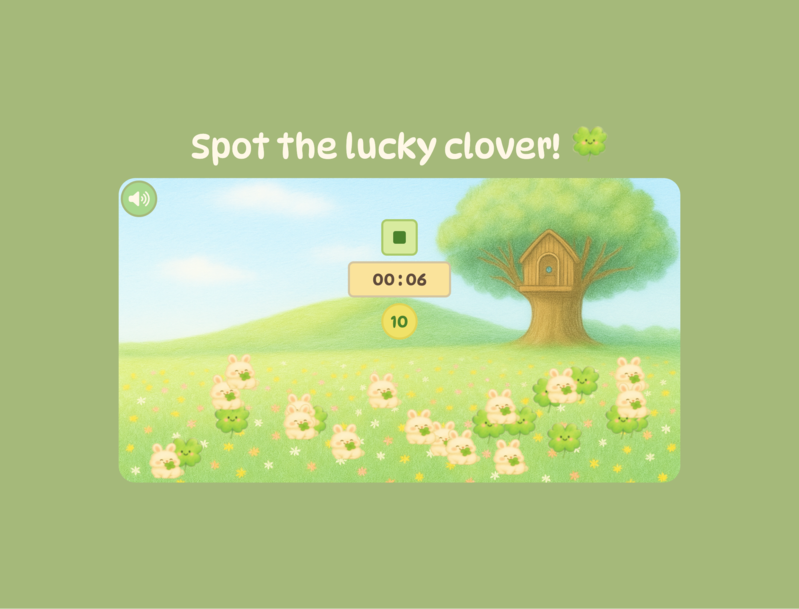
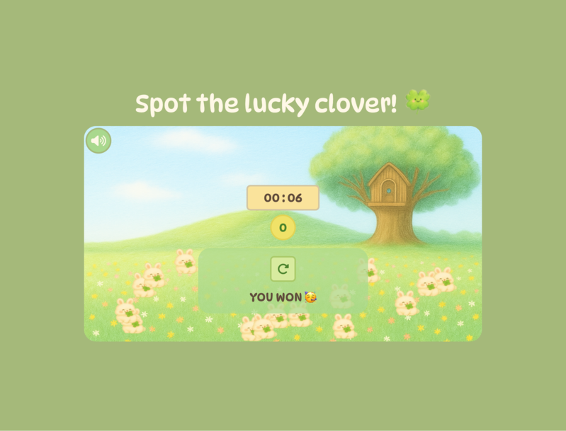
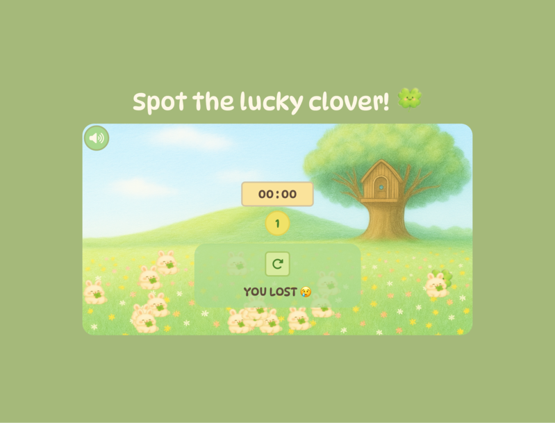

<div align="center">


# 🍀 Spot the Lucky Clover! (Fast Click Game)


> 🧩 Version 1.0.0 — Initial release featuring core click mechanics, timer, and sound feedback.

</div>

A light-hearted **click-reaction game** where players must find and click all the four-leaf clovers before time runs out.  
Built with **HTML, CSS, and Vanilla JavaScript**, this is version 1.0 — the foundation for a larger interactive experience.

---

## 🎮 Live Demo

🎥 **Watch the Demo:**  
[](https://www.loom.com/share/e81e59fe0a104d86b03ed0a96dc9cc50)

🔗 [**Play the Game Here**](https://byte-nana.github.io/fast-click-game/)

---

## 📸 Game Screenshots

|                      Main Screen                       |                       You Win!                       |                       Game Over                        |
| :----------------------------------------------------: | :--------------------------------------------------: | :----------------------------------------------------: |
|  |  |  |

---

## 💡 Project Overview

This first version of **Spot the Lucky Clover** introduces the main mechanics — timing, score tracking, and instant sound feedback.  
The aim is to build a fast-paced yet relaxing game atmosphere using a nature-inspired theme, fun sounds, and a playful layout.

Players click the **four-leaf clovers** to score, but beware — clicking a **rabbit** ends the game!  
Once all the lucky leaves are found within the time limit, the player wins 🥳

---

## 🎯 Learning Goals

- Strengthen understanding of **DOM manipulation** and event handling.
- Implement **timers, counters, and conditional logic** in JavaScript.
- Learn to manage **audio playback** and control states programmatically.
- Apply **CSS transitions and responsive layouts** for game UIs.
- Build a project foundation that can evolve into multiple difficulty levels.

---

## 🧩 Key Features

| Feature                     | Description                                                   |
| :-------------------------- | :------------------------------------------------------------ |
| 🕹️ **Interactive gameplay** | Click the clovers before time runs out.                       |
| 🐇 **Dynamic objects**      | Four-leaf clovers and rabbits appear in random positions.     |
| 🎧 **Sound effects**        | Separate sounds for clover, rabbit, win, and alert events.    |
| ⏱️ **Countdown timer**      | 10-second timer creates pressure and excitement.              |
| 🧾 **Scoreboard**           | Displays remaining clovers left to find.                      |
| 🖼️ **Themed UI**            | Background, icons, and fonts reinforce the natural aesthetic. |

---

## 🧠 Tech Stack

| Layer   | Technology                                               |
| :------ | :------------------------------------------------------- |
| Markup  | HTML5                                                    |
| Styling | CSS3 (Custom Properties, Transitions, Responsive Design) |
| Logic   | Vanilla JavaScript (ES6 Syntax)                          |
| Sound   | HTML5 `<audio>` with JavaScript control                  |

---

## 📁 Folder Structure

```
.
├── asset
│   ├── colour-palette.png
│   ├── favicon
│   │   ├── android-chrome-192x192.png
│   │   ├── android-chrome-512x512.png
│   │   ├── apple-touch-icon.png
│   │   ├── favicon-16x16.png
│   │   ├── favicon-32x32.png
│   │   ├── favicon.ico
│   │   └── site.webmanifest
│   ├── image
│   │   ├── background.png
│   │   ├── four-leaf.png
│   │   ├── rabbit.png
│   │   └── three-leaf.png
│   ├── screenshot
│   │   ├── Screenshot-lose.png
│   │   ├── Screenshot-main.png
│   │   ├── Screenshot-retry.png
│   │   └── Screenshot-win.png
│   └── sound
│       ├── alert.wav
│       ├── bg.mp3
│       ├── game-win.wav
│       ├── leaf-pull.wav
│       └── rabbit-pull.wav
├── css
│   └── style.css
├── index.html
├── README.md
└── src
    ├── main-refactor.js
    └── main.js
```

---

## 🧭 Gameplay Logic Overview

- **Game starts** → clovers and rabbits are rendered in random positions.
- **Click clover** → plays “leaf-pull” sound, removes it, and updates score.
- **Click rabbit** → plays “rabbit-pull” sound and triggers game over.
- **Timer ends** → checks if all clovers found; shows win/lose alert.
- **Replay button** resets everything instantly.

---

## 🧩 Future Development (Planned Updates)

- 🎯 **Levels** — introduce multi-stage difficulty and speed scaling.
- 🐇 **Moving rabbit** — make the rabbit jump or slide to distract players.
- ☘️ **Three-leaf clovers** — add fake items to increase challenge.
- 🔊 **Volume controls** — manage music and sound effect separately.
- 📱 **Optimised mobile gameplay** — improved touch handling.

---

## 👩‍💻 About the Developer

**Developed by [Byte-nana](https://github.com/byte-nana)**  
An aspiring front-end developer exploring **creative JavaScript games** that mix logic, timing, and playful design.

---

## 🧾 Licence

Released under the [MIT Licence](LICENSE).

---

<div align="center">
  <sub>Made with ☘️ and curiosity in London • 2025</sub>
</div>
